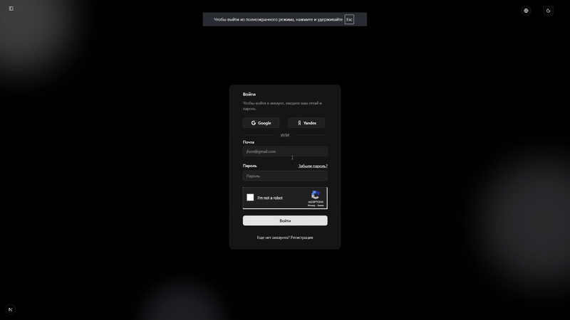
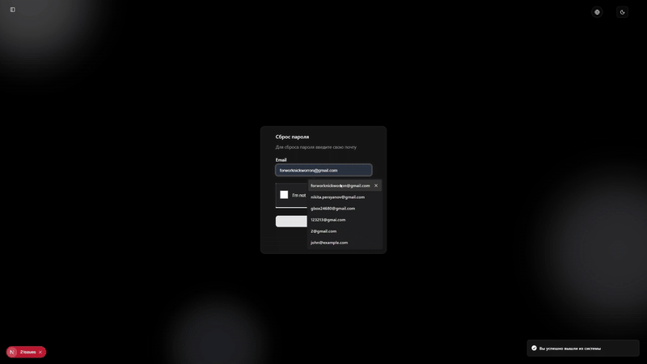
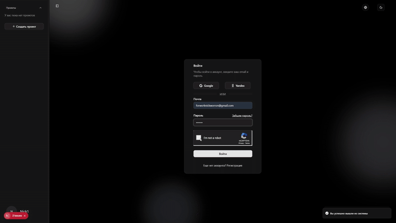
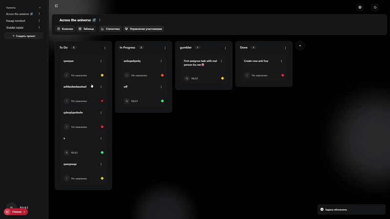
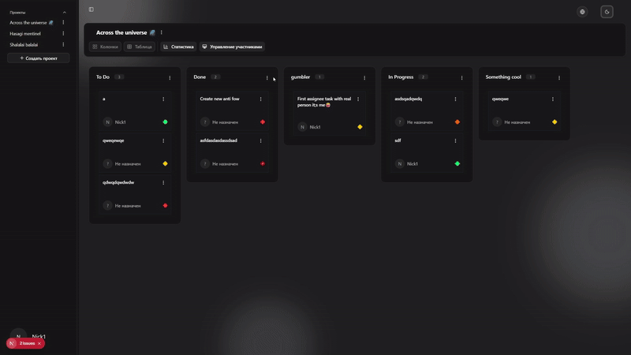
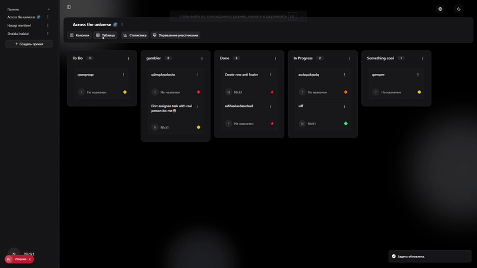
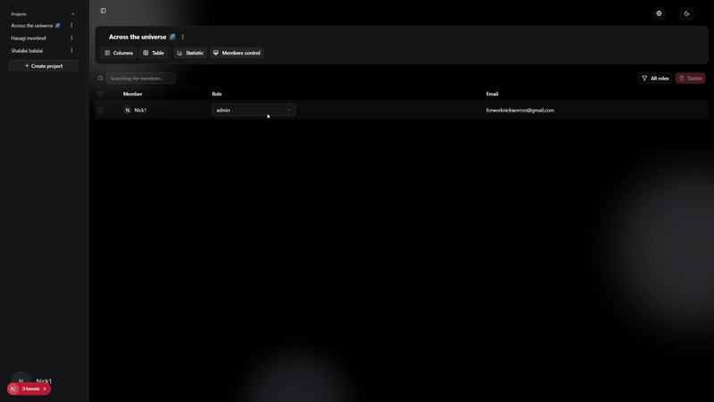

# KANBAN-ULTRA

**Русский:** Прогрессивная канбан-доска для эффективного управления проектами и задачами.  
**English:** Progressive Kanban board for efficient project and task management.

---

## 🎬 Демонстрация проекта / Project Demo

Ниже представлены основные функции проекта в действии.

 GIF                                            | Описание / Description                                                                                                                            |
------------------------------------------------|---------------------------------------------------------------------------------------------------------------------------------------------------|
     | Русский: OAuth вторизация.   English: OAuth authorization.                                                                                     |
|       | Русский: Стандартный вход, сброс пароля с кодом по почте.   English: Standard login, password reset with code by mail.                         |
|  | Русский: Вход с кодом двухфакторной аутентификаций.   English: Login with two-factor authentication code.                                      |
       | Русский: Презентация канбан доски, ДрагНДроп и созданение колонок.   English: Presentation of Kanban board, DragNdrop and creation of columns. |
   | Русский: Презентация канбан доски, ДрагНДроп и созданение колонок.   Presentation of Kanban board, DragNdrop and creation of columns.          |
   | Русский: Табличный вид канбан доски, статистика и аналитика.   English: Table view of kanban board, statistics and analytics.                  |
   | Русский: Админ панель управления участниками.   English: Administrator control panel for participants.                                         |

> 💡 Совет: Старайся делать GIF маленького размера (<5–6 МБ), чтобы README грузился быстро.

## 📌 О проекте / About the Project

**Русский:**  
KANBAN-ULTRA — это современная канбан-доска с прогрессивными методами авторизации: двухфакторная аутентификация,
подтверждение аккаунта по почте. Можно входить через логин и пароль или социальные сети. Проект позволяет:

- Добавлять участников по почте с приглашениями.
- Использовать драг-н-дроп для задач и колонок.
- Гибко управлять проектами и участниками.
- Отслеживать аналитику и статистику проектов.
- Менять вид с канбан-доски на таблицу.

**English:**  
KANBAN-ULTRA is a modern Kanban board with advanced authentication methods: two-factor authentication, email
verification. Users can log in via username/password or social networks. The project allows you to:

- Invite participants by email.
- Use drag-and-drop for tasks and columns.
- Flexibly manage projects and team members.
- Track project analytics and statistics.
- Switch between Kanban view and table view.

---

## ✨ Фичи / Features

**Русский:**

- Добавление участников с приглашением по почте
- Двухфакторная аутентификация
- Подтверждение аккаунта по почте
- Аутентификация через логин/пароль и социальные сети (Google, Яндекс)
- Drag & Drop для задач и колонок
- Расширенная аналитика и статистика проекта
- Кеширование данных
- SSR рендеринг
- Смена тем оформления
- Локализация интерфейса
- Полный функционал канбан-доски

**English:**

- Invite participants via email
- Two-factor authentication
- Email verification
- Login via username/password or social networks (Google, Yandex)
- Drag & Drop for tasks and columns
- Advanced project analytics and statistics
- Data caching
- Server-side rendering (SSR)
- Theme switching
- Interface localization
- Full Kanban board functionality

---

## 🛠 Использованные технологии / Tech Stack

**Frontend:**

- Next.js
- Axios
- TanStack Query
- i18n (react-i18next)
- Shadcn UI
- React Hook Form + Zod
- Context API
- Hello-Pangea DnD
- FSD architecture
- Docker